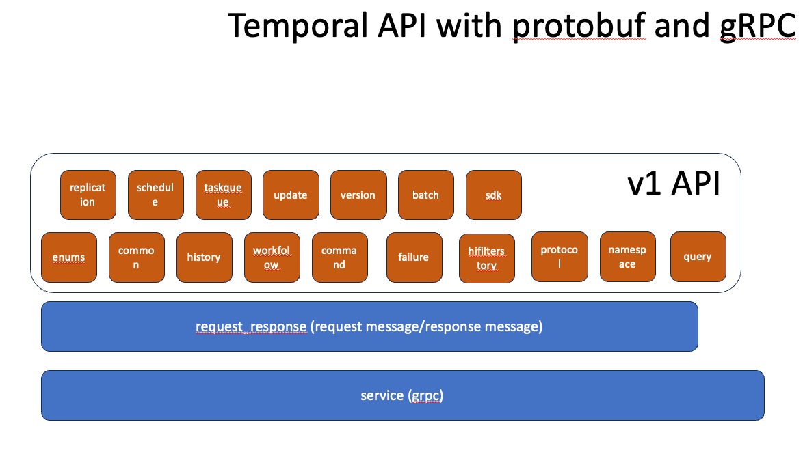
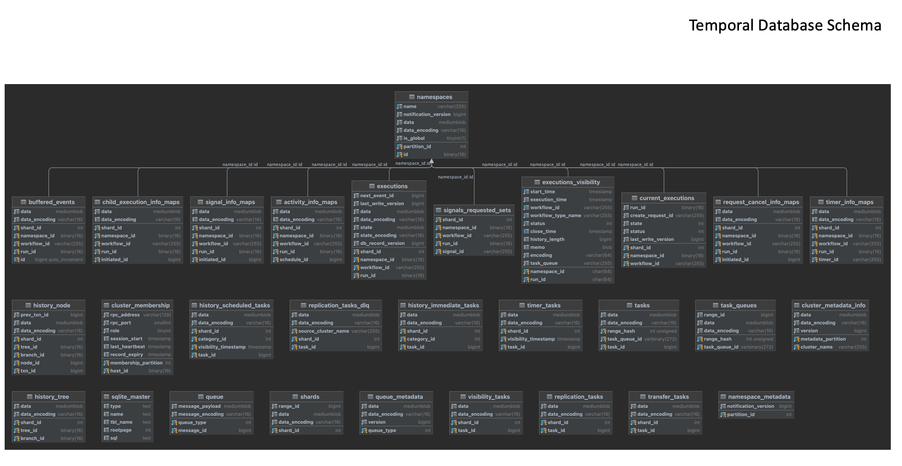

# Temporal proto files  

## How to use

Install as git submodule to the project.

## License

MIT License, please see [LICENSE](LICENSE) for details.

## gRPC Services sepecifies in the protobuf files.
We build the temporal API using JetBrains IntelliJ and JetBrains GoLand and see how the generated code used in the development of Java-SDK and Go-SDK. The objectives of the TemporalAPI are

To understand the SDK Wrapper
To understand the Temporal Server activities via debugging the Temporalite using JetBrains GoLand
etc…

The objectives of the Temporal Database are

To understand the data and/or information are being persisted
To understand the data and/or information are being persisted when the temporal server crashes and recoveries
etc…
